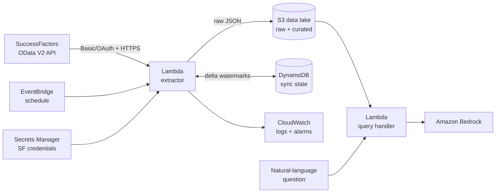

# SuccessFactors → AWS HR Data Integration Pipeline

A serverless integration that extracts Employee Central data from SAP
SuccessFactors through its OData V2 API on a schedule, lands it in an S3 data
lake with incremental (delta) extraction, and answers natural-language
questions about the workforce data through Amazon Bedrock.



## What it demonstrates

- **SAP ↔ AWS integration**: OData V2 extraction with pagination (`__next` /
  `$skiptoken`), field projection (`$select`), delta extraction
  (`$filter=lastModifiedDateTime gt ...`), SF legacy date parsing
  (`/Date(ms)/`), Basic auth, retries with exponential backoff on 429/5xx.
- **Serverless AWS architecture**: Lambda + EventBridge schedule + S3 data
  lake (raw zone partitioned by date, curated CSV snapshots upserted per
  business key) + DynamoDB watermark table + Secrets Manager.
- **Infrastructure as code**: the entire stack provisions from zero with one
  `terraform apply`, with least-privilege IAM per function.
- **Telemetry & diagnostics**: structured run summaries in CloudWatch Logs,
  an errors alarm, and a "no successful run in 24h" freshness alarm.
- **AI/ML layer**: a Bedrock-powered Q&A Lambda grounded in the curated data,
  with a responsible-AI guardrail refusing questions about restricted
  attributes.

The extractor uses **only the Python standard library**, so the Lambda deploys
as a plain source zip - no dependency bundling, no layers.

## Repository layout

```text
src/sf_extractor/    extraction package (OData client, state, storage, orchestration)
src/lambda_function.py       extraction Lambda entry point
bedrock_query/       Bedrock Q&A Lambda
mock_sf/             mock SuccessFactors OData server (local dev + tests)
terraform/           full AWS stack
tests/               pytest suite (runs against the mock server)
```

## Local development (no AWS account needed)

```bash
# 1. start the mock SuccessFactors API
python3 mock_sf/server.py --port 8000
# credentials: demo@DEMO / demo

# 2. run a full extraction against it
export SF_USERNAME="demo@DEMO" SF_PASSWORD="demo"
PYTHONPATH=src python3 -m sf_extractor.run \
    --base-url http://127.0.0.1:8000/odata/v2 \
    --output ./data --state ./state.json

# 3. run it again: watermarks kick in, 0 records are re-pulled (delta)

# 4. tests
python3 -m pytest tests/ -v
```

## Running against a real SuccessFactors tenant

```bash
export SF_USERNAME="APIUSER@COMPANYID" SF_PASSWORD="..."
PYTHONPATH=src python3 -m sf_extractor.run \
    --base-url https://apisalesdemo2.successfactors.eu/odata/v2 \
    --output ./data --state ./state.json
```

Notes:
- The API user needs *SFAPI User Login* and *Admin access to OData API*
  permissions (Admin Center → Manage Permission Roles).
- Extraction is strictly **read-only** against the tenant.
- Production tenants typically require OAuth 2.0 (SAML bearer assertion)
  instead of Basic auth; the client's auth header injection is the single
  place to swap that in.

## Deploying to AWS

```bash
cd terraform
terraform init
terraform apply

# set the SuccessFactors credentials (never stored in Terraform state/code)
aws secretsmanager put-secret-value \
    --secret-id "$(terraform output -raw secret_arn)" \
    --secret-string '{"username":"APIUSER@COMPANYID","password":"..."}'

# trigger a run manually (otherwise EventBridge runs it hourly)
aws lambda invoke --function-name "$(terraform output -raw extractor_function)" \
    --payload '{"full": true}' --cli-binary-format raw-in-base64-out /dev/stdout

# ask a question over the curated data (requires Bedrock model access enabled)
aws lambda invoke --function-name "$(terraform output -raw query_function)" \
    --payload '{"question": "How many people work in Engineering, and in which locations?"}' \
    --cli-binary-format raw-in-base64-out /dev/stdout
```

## Design decisions

- **Why delta extraction with a watermark table?** Full extracts don't scale
  and hammer the source API. Persisting the max `lastModifiedDateTime` per
  entity in DynamoDB makes runs incremental, idempotent, and cheap
  (single-item reads/writes).
- **Why raw + curated zones?** The raw zone is an immutable audit trail of
  exactly what the API returned; the curated zone is a queryable
  latest-state snapshot upserted by business key. Standard lakehouse
  layering, in miniature.
- **Why stdlib-only?** Removes Lambda packaging complexity entirely and keeps
  cold starts minimal. `boto3` is provided by the Lambda runtime.
- **Guardrails on the Q&A Lambda**: questions touching compensation or
  identity attributes are refused before any model call, and the system
  prompt constrains answers to the provided data.

## Security

- Credentials live in Secrets Manager (cloud) or environment variables
  (local); nothing sensitive is committed.
- The S3 bucket blocks all public access, is versioned, and is encrypted at
  rest; IAM policies are least-privilege per function.
- All tenant access is read-only.
